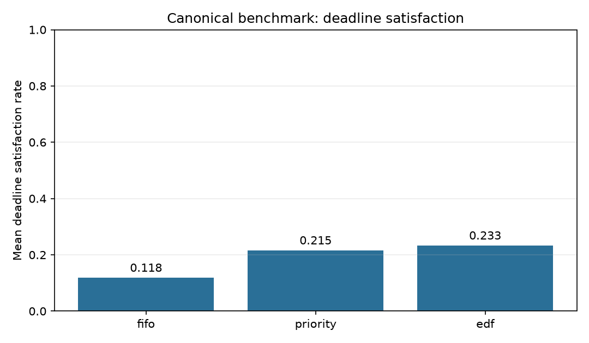
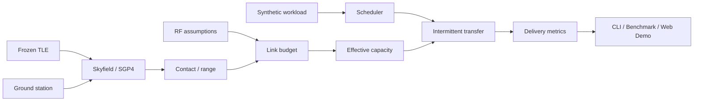

# MedLink-LEO

Reliable medical-data delivery over constrained LEO satellite links.

MedLink-LEO simulates deadline-constrained synthetic medical-data delivery over intermittent LEO
satellite links by combining SGP4 orbit propagation, a documented RF link model, and deterministic
scheduling algorithms.

It brings orbital mechanics, RF link budgeting, networking and scheduling, deterministic
simulation, and reproducible experimental evaluation into one testable package.

**Engineering problem:** when short contact windows cannot carry every queued item, how does the
scheduling rule change delivery deadlines, latency, and completed workload?

## What is actually implemented

- FIFO, illustrative medical-priority, and earliest-deadline-first (EDF) schedulers with explicit
  deterministic tie-breaking.
- Fixed-bandwidth and orbit-driven intermittent-link simulators.
- Frozen historical TLE propagation through Skyfield/SGP4; range, azimuth/elevation, and contact
  windows for a validated ground-station model.
- Free-space path loss, received power, thermal noise, SNR, Shannon capacity upper bound, explicit
  implementation efficiency, and optional link margin.
- Single-hop resumable transfers: contact loss pauses the active item without discarding bits.
- Deadline, latency, delivered/undelivered/deferred, capacity, and utilization metrics.
- A seeded 108-run benchmark, machine-readable outputs, generated plots, CLI, and offline Web Demo.
- Installable packaging, tests, Ruff, GitHub Actions configuration, and a Streamlit Dockerfile.

## Real canonical result

The committed canonical benchmark covers 36 physical/workload conditions per scheduler. Each
scheduler sees the same workload and precomputed orbit/link trace in every matched condition.

| Scheduler | Mean deadline satisfaction | Critical-class satisfaction | Mean latency | Delivered |
| --- | ---: | ---: | ---: | ---: |
| FIFO | 11.81% | 12.50% | 1865.37 s | 51 / 288 |
| Priority | 21.53% | 50.00% | 816.54 s | 69 / 288 |
| EDF | 23.26% | 50.00% | 993.11 s | 75 / 288 |

In this deliberately constrained matrix, EDF has the highest mean deadline satisfaction and
delivered count, while Priority has the lowest mean delivered-item latency. This is an observed
result inside the documented assumptions, not a claim that one scheduler is universally best.
Mean link utilization is 100% for all three strategies, so the experiment represents saturated
contact capacity.

[Benchmark config](experiments/canonical_benchmark.json) ·
[JSON result](docs/assets/benchmark/summary.json) ·
[table result](docs/assets/benchmark/summary.md) ·
[methodology](docs/methodology.md)



## Architecture



The CLI, experiment runner, and Streamlit app call the same package APIs. See
[architecture.md](docs/architecture.md) for boundaries and extension points.

## Demo

The bundled Streamlit demo starts with a synthetic scenario and the frozen TLE already selected.
It requires no API key or live network fetch. One **Run Simulation** action produces contact/link
plots, delivery detail, pause counts, and an equal-input three-scheduler comparison.

```powershell
streamlit run app/streamlit_app.py
```

No public demo URL is claimed. The repository is locally runnable and deployment-ready; see
[deployment.md](docs/deployment.md).

## Scheduling comparison

| Strategy | Selection order among ready items |
| --- | --- |
| FIFO | `created_at_s`, then `id` |
| Priority | `priority`, `created_at_s`, then `id` |
| EDF | absolute due time, `priority`, `created_at_s`, then `id` |

All strategies are non-preemptive with respect to other items. During an active transfer,
connectivity may pause and later resume that same item. A new high-priority arrival waits until the
active item completes.

## Satellite, orbit, and link model

- **Orbit:** Skyfield uses SGP4 with a bundled ISS (ZARYA) TLE whose epoch is
  `2014-01-20T22:23:04Z`. Examples run near that epoch and never describe it as current tracking.
- **Visibility:** station-relative azimuth, elevation, range, an elevation mask, and contact-window
  extrema are derived with timezone-aware UTC inputs.
- **RF:** range drives free-space path loss and received power; ideal `kTB` noise produces SNR.
- **Capacity:** `B log2(1 + SNR)` is named only as a channel-capacity upper bound. The transferred
  rate is an explicit `implementation_efficiency` fraction, not verified modem throughput.
- **Numerics:** the default 1 s step uses deterministic midpoint sampling. A 0.5 s convergence
  sanity check is in the test suite.

Detailed units and authoritative references are in [equations.md](docs/equations.md). The frozen
fixture and source are documented in [orbit-fixture.md](docs/orbit-fixture.md).

## Benchmark methodology and reproduction

The canonical matrix sweeps three offered loads, three deadline factors, two elevation masks, two
RF capacity presets, and three schedulers. It uses seed `20260830`, two workload repetitions, the
same historical orbit interval, and a 1 s timestep. Workload values are illustrative, not
clinically validated.

```powershell
python -m medlink benchmark `
  --config experiments/canonical_benchmark.json `
  --output-dir artifacts/benchmark `
  --publish-dir docs/assets/benchmark
```

The command writes raw CSV, deterministic CSV/JSON/Markdown summaries, plots, and separately
identified variable run metadata. The committed evidence can be regenerated from code, and a
regression test checks this README table against the committed JSON summary.

## Quick start

Python 3.11 or newer is required. The CI matrix targets Python 3.11 and 3.12.

```powershell
python -m pip install -e ".[dev]"
python -m medlink compare --scenario examples/basic_scenario.json
python -m medlink compare --scenario examples/end_to_end_scenario.json
```

## CLI

```powershell
# One scheduler, human-readable
python -m medlink simulate --scenario examples/basic_scenario.json --strategy edf

# All schedulers, deterministic machine-readable output
python -m medlink compare --scenario examples/basic_scenario.json --json

# Orbit-driven comparison
python -m medlink compare --scenario examples/end_to_end_scenario.json --json
```

Supported strategies are `fifo`, `priority`, and `edf`. CLI code is a thin adapter over reusable
scenario and simulation functions.

## Testing and engineering quality

```powershell
python -m pytest
python -m ruff check .
```

- Unit and integration coverage includes scheduling, validation, RF reference calculations,
  frozen-orbit contacts, pause/resume semantics, timestep sanity, CLI, benchmark determinism, and
  Streamlit's supported AppTest path.
- Release Candidate verification on Python 3.12.13: 72 tests passed, Ruff passed, and package
  dependency checks reported no conflicts.
- `.github/workflows/ci.yml` configures install, lint, and tests on Python 3.11 and 3.12. A remote
  run has not been observed because nothing was pushed.
- `Dockerfile` launches the offline Web Demo. Docker was unavailable on the verification host, so
  the configuration was inspected but a local image build is not claimed.
- No credentials, private keys, `.env` file, real patient data, or required runtime network call is
  present in the repository scan.

Observed commands and environment limitations are recorded in [status.md](docs/status.md).

## Repository structure

```text
src/medlink/       tested models, scheduling, RF, orbit, simulation, metrics, CLI, experiments
app/               Streamlit presentation layer
examples/          synthetic fixed and intermittent scenarios
experiments/       canonical benchmark configuration
tests/             unit, integration, determinism, CLI, and Web Demo tests
docs/              architecture, equations, assumptions, methodology, status, deployment
docs/assets/       small generated benchmark evidence committed for review
.github/workflows/ local CI configuration
```

## Assumptions and limitations

The implemented model is single-satellite, single-ground-station, single-hop, and non-preemptive.
It omits protocol headers, retransmissions, congestion control, atmospheric/rain fading,
interference, pointing loss, adaptive coding/modulation, and multi-hop routing. `undelivered`
means incomplete at the finite horizon; `deferred` is the subset whose deadline lies beyond it.

See [assumptions.md](docs/assumptions.md) for the complete boundary.

## Future work

Promising extensions include validated propagation losses, modem/coding profiles, preemptive or
chunked scheduling, multi-contact abstractions, and sensitivity analysis. Multi-satellite routing,
full DTN/Bundle Protocol, packet-level transport, authentication, databases, and real clinical
data are intentionally not implemented. See [roadmap.md](docs/roadmap.md).

## Safety disclaimer

> **MedLink-LEO uses synthetic medical data only. It is an engineering simulation project and is
> not intended for diagnosis, treatment, clinical decision-making, or real-world medical
> operations.** Priority labels are illustrative simulation classes, not clinical guidance.

## License

MedLink-LEO is available under the [MIT License](LICENSE). Copyright (c) 2026 yoshitani-dev.
