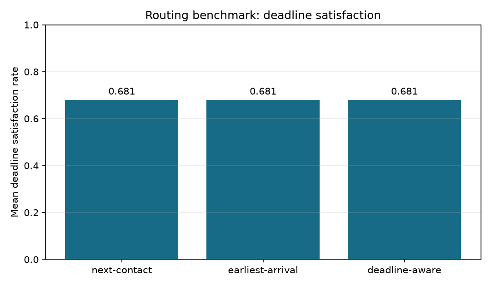
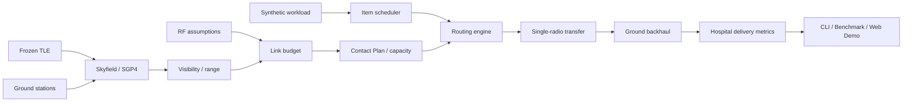

# MedLink-LEO

Reliable medical-data delivery over constrained LEO satellite links.

[](https://github.com/dev-yoshitani/medlink-leo/actions/workflows/ci.yml)

MedLink-LEO is a deterministic engineering simulator for routing deadline-constrained synthetic
medical data through intermittent LEO contacts. It combines frozen-TLE SGP4 propagation,
ground-station visibility, an RF link budget, contact-capacity integration, medical-item
scheduling, and transparent route selection in one tested Python package.

**Engineering problem:** the first satellite contact is not always the fastest path to a hospital.
Different contacts offer different RF capacity, timing, propagation delay, and terrestrial
backhaul, while multiple queued items contend for one satellite radio.

## Contact-Plan-Aware Medical Routing — new in v1.1

```text
Remote Clinic (uplink abstracted)
              ↓
        LEO Satellite
         ↙    ↓    ↘
     Seoul  Sapporo  Tokyo
         ↘    ↓    ↙
        Hospital Gateway
```

- A deterministic **Contact Plan** states who can downlink to whom, when, and with how many
  RF-derived bits.
- Existing FIFO, illustrative Medical Priority, and EDF decide **which item is next**.
- Next Available Contact, Earliest Arrival, and Deadline-Aware routing decide **which contact and
  ground station that item should use**.
- Every result exposes candidates, capacity, estimated hospital arrival, deadline feasibility,
  failure reason, and a deterministic **Why this route?** explanation.
- The default offline Streamlit mode compares all routes with no login, API key, or live TLE.

## Real v1.1 routing benchmark

The committed canonical routing matrix contains 216 runs: 72 matched workload, deadline,
backhaul, contact-availability, and RF-capacity conditions per route policy. EDF scheduling and the
frozen historical orbit are held constant.

| Routing strategy | Mean deadline satisfaction | Critical-class satisfaction | Delivery ratio | Mean end-to-end latency | Delivered |
| --- | ---: | ---: | ---: | ---: | ---: |
| Next Contact | 68.06% | 100.00% | 75.00% | 1063.56 s | 216 / 288 |
| Earliest Arrival | 68.06% | 100.00% | 75.00% | 1048.20 s | 216 / 288 |
| Deadline-Aware | 68.06% | 100.00% | 68.06% | 529.17 s | 196 / 288 |

In this documented matrix, Earliest Arrival slightly reduces latency while preserving the Next
Contact delivery count. Deadline-Aware refuses routes estimated to arrive late, so it preserves
the same deadline-satisfaction rate but delivers fewer items. Its lower mean latency is conditional
on that smaller delivered set. These are scenario-specific tradeoffs, not a universal ranking.

[Routing benchmark config](experiments/canonical_routing_benchmark.json) ·
[JSON result](docs/assets/routing-benchmark/summary.json) ·
[table result](docs/assets/routing-benchmark/summary.md) ·
[methodology](docs/methodology.md)



## Architecture



The routing layer reuses the same range-to-capacity integration as the v1.0 intermittent
simulator; it does not duplicate orbital or RF equations. See
[architecture.md](docs/architecture.md) and [routing.md](docs/routing.md).

## Interactive demo

```powershell
python -m pip install -e ".[dev]"
streamlit run app/streamlit_app.py
```

The first screen opens **Contact-Plan Routing** with the bundled three-station scenario and frozen
TLE. One **Compare Routing Strategies** action shows route metrics, contact capacity, station
backhaul, estimated arrivals, deadline margins, explicit outcomes, and Why this route? evidence.
The **Existing Simulation** mode preserves the v1.0 scheduler and pause/resume demonstration.

The app is prepared for Streamlit Community Cloud through root `requirements.txt` and
`app/streamlit_app.py`; no environment variables are required. No public demo URL is claimed.
See [deployment.md](docs/deployment.md).

## What is implemented

- Frozen historical TLE propagation through Skyfield/SGP4; range, azimuth/elevation, and
  minimum-elevation contact windows.
- Free-space path loss, received power, ideal `kTB` thermal noise, SNR, Shannon capacity upper
  bound, explicit implementation efficiency, and optional link margin.
- Fixed-bandwidth and orbit-driven intermittent simulators, including non-preemptive transfer
  pause/resume with retained bits.
- Multi-ground-station Contact Plan with integrated capacity and one-way propagation delay.
- Separate deterministic scheduling and routing modules with capacity contention.
- `NO_CONTACT`, `INSUFFICIENT_CAPACITY`, `DEADLINE_INFEASIBLE`, and
  `OUTSIDE_SIMULATION_HORIZON` results.
- Two independent canonical benchmarks, stable JSON/CSV, plots, CLI, and offline Streamlit UI.
- Installable Python 3.11+ packaging, pytest, Ruff, read-only GitHub Actions, Dockerfile, and
  Streamlit Community Cloud configuration.

## Route strategies

| Strategy | Deterministic decision rule |
| --- | --- |
| Next Available Contact | Earliest feasible RF departure; capacity and stable IDs break ties |
| Earliest Arrival | Earliest hospital arrival after waiting, RF transfer, propagation, and backhaul |
| Deadline-Aware | Deadline-feasible candidates first, then earliest arrival and remaining capacity |

An item must fit within one unelapsed contact; v1.1 does not split an item across contacts. The
satellite radio is single-channel and successful RF completion advances its shared clock.
Backhaul affects hospital arrival but does not occupy the satellite radio.

## Why was this station selected?

For each item, the engine evaluates every remaining contact and records:

- contact start/end and unelapsed capacity;
- required bits and dynamic-rate transfer time;
- RF departure/completion and propagation delay;
- station backhaul and estimated hospital arrival;
- deadline/horizon feasibility and deterministic tie-breaks.

The selected candidate and all rejected candidates appear in CLI JSON and the Streamlit Ground
Station comparison table. No LLM generates the explanation.

## Preserved v1.0 scheduling benchmark

The original `canonical-v1.0` 108-run result remains unchanged and reproducible.

| Scheduler | Mean deadline satisfaction | Critical-class satisfaction | Mean latency | Delivered |
| --- | ---: | ---: | ---: | ---: |
| FIFO | 11.81% | 12.50% | 1865.37 s | 51 / 288 |
| Priority | 21.53% | 50.00% | 816.54 s | 69 / 288 |
| EDF | 23.26% | 50.00% | 993.11 s | 75 / 288 |

Inside that saturated single-link matrix, EDF has the highest mean deadline satisfaction and
delivered count, while Priority has the lowest mean delivered-item latency. This is not a claim
that either scheduler is universally best.

[v1.0 config](experiments/canonical_benchmark.json) ·
[v1.0 JSON result](docs/assets/benchmark/summary.json) ·
[v1.0 table](docs/assets/benchmark/summary.md)

## Orbit, link, and numerical model

- **Orbit:** the bundled ISS (ZARYA) TLE epoch is `2014-01-20T22:23:04Z`; examples run near it and
  never claim current tracking.
- **Visibility:** station-relative geometry and contact extrema use timezone-aware UTC inputs.
- **Capacity:** `B log2(1 + SNR)` is only a channel-capacity upper bound. Effective rate is an
  explicit `implementation_efficiency` fraction, not verified modem throughput.
- **Numerics:** the canonical 1 s timestep uses deterministic midpoint sampling. Existing tests
  include a 0.5 s sanity comparison.

Detailed units and sources are in [equations.md](docs/equations.md); fixture provenance is in
[orbit-fixture.md](docs/orbit-fixture.md).

## Quick start and CLI

Python 3.11 or newer is required; Python 3.12 is the verified RC environment.

```powershell
python -m pip install -e ".[dev]"

# v1.1 routing
python -m medlink route --scenario examples/contact_plan_medical_routing.json --strategy next-contact
python -m medlink route --scenario examples/contact_plan_medical_routing.json --strategy earliest-arrival --json
python -m medlink route --scenario examples/contact_plan_medical_routing.json --strategy deadline-aware
python -m medlink route-compare --scenario examples/contact_plan_medical_routing.json --json

# Preserved v1.0 simulation
python -m medlink compare --scenario examples/basic_scenario.json
python -m medlink compare --scenario examples/end_to_end_scenario.json --json
```

Canonical routing evidence is regenerated with:

```powershell
python -m medlink routing-benchmark `
  --config experiments/canonical_routing_benchmark.json `
  --output-dir artifacts/routing-benchmark `
  --publish-dir docs/assets/routing-benchmark
```

Exact factors, held constants, metrics, and interpretation limits are in
[methodology.md](docs/methodology.md).

## Testing and engineering quality

```powershell
python -m pip check
python -m pytest
python -m ruff check .
```

Coverage includes validation, RF reference calculations, frozen-orbit contacts, pause/resume,
contact-plan construction, three routing policies, backhaul-sensitive selection, capacity
contention, deterministic tie-breaking, failure reasons, CLI JSON, both benchmarks, and Streamlit
AppTest. `.github/workflows/ci.yml` runs install, Ruff, and pytest on Python 3.11 and 3.12 with
`contents: read`. The published `main` workflow is verified green in
[GitHub Actions](https://github.com/dev-yoshitani/medlink-leo/actions/workflows/ci.yml).

## Repository structure

```text
src/medlink/routing/       contact plan, route policies, results, metrics
src/medlink/simulation/    fixed/intermittent transfer and shared capacity integration
src/medlink/orbit/         frozen TLE, SGP4, station visibility
src/medlink/link/          RF equations and effective-rate abstraction
app/                       Streamlit presentation layer
examples/                  synthetic v1.0 and v1.1 scenarios
experiments/               independent scheduler and routing benchmark configs
docs/assets/               small generated evidence committed for review
tests/                     unit, integration, determinism, CLI, and Web tests
```

## Assumptions and limitations

The clinic uplink is abstracted: data is available on the satellite at creation time. Routing is
greedy, one-satellite, one-radio, and one-contact-per-item. It is not full DTN/BPv7 and omits
contact splitting, multi-satellite routing, packet protocols, retransmissions, fading,
interference, adaptive RF/MCS, and operational/clinical validation. See
[assumptions.md](docs/assumptions.md).

## Future work

Promising next steps are validated propagation losses, modem/coding profiles, bounded global
capacity allocation, explicit store-carry-forward semantics, and multi-satellite Contact Plans.
They are intentionally not implemented in v1.1. See [roadmap.md](docs/roadmap.md).

## Safety disclaimer

> **MedLink-LEO uses synthetic medical data only. It is an engineering simulation project and is
> not intended for diagnosis, treatment, clinical decision-making, or real-world medical
> operations.** Priority labels are illustrative simulation classes, not clinical guidance.

## License

MedLink-LEO is available under the [MIT License](LICENSE). Copyright (c) 2026 yoshitani-dev.
