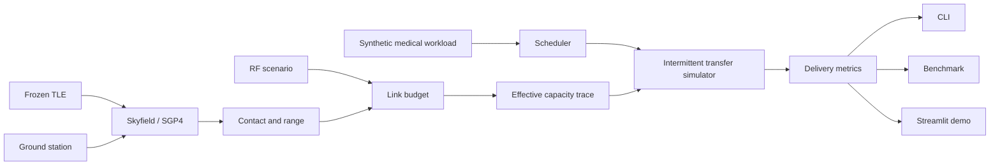

# Architecture

MedLink-LEO separates physical modeling, scheduling, simulation, analysis, and presentation so
that the CLI, benchmark, and Web Demo all exercise the same tested package.

## Module boundaries

| Module | Responsibility |
| --- | --- |
| `models` | Validated medical items, priorities, and fixed-link configuration |
| `scheduling` | Deterministic FIFO, Priority, and EDF selection functions |
| `link` | Static RF equations and the range-independent dynamic-link template |
| `orbit` | Frozen TLE loading, UTC handling, SGP4 propagation, and contact windows |
| `scenarios` | JSON loading, validation, and fixed/intermittent scenario types |
| `simulation` | Fixed-link execution, capacity traces, pause/resume transfers, and public API |
| `metrics` | Fixed-link delivery metric calculation |
| `experiments` | Canonical benchmark matrix, artifacts, summaries, and plots |
| `cli` | Argument parsing and human/JSON presentation only |
| `app` | Streamlit presentation over the public scenario and simulation APIs |

## End-to-end data flow

1. The scenario loader validates units, finite values, identifiers, UTC times, RF inputs, and a
   finite simulation horizon.
2. Skyfield propagates the frozen TLE near its epoch. Ground-station geometry produces range,
   azimuth, elevation, and contact windows.
3. Each deterministic simulation interval is sampled at its midpoint. Range enters the RF link
   budget and produces an explicit effective-rate abstraction.
4. A scheduler selects one ready item. It remains active until complete; contact loss pauses it,
   and the next contact resumes it with already transferred bits retained.
5. Delivery outcomes feed common result objects, CLI JSON, benchmark records, and the Web Demo.

## Interfaces and extension points

- A scheduler is a selection callable registered in `scheduling.strategies`; adding one does not
  require simulator changes.
- `simulation.simulate()` and `compare_strategies()` dispatch by scenario type and are the public
  entry points for clients.
- `RFLinkTemplate.at_range()` isolates the range-dependent calculation from scenario parsing.
- Benchmark workload generation and physical traces are shared across schedulers to preserve a
  fair comparison.
- Future channel or orbit implementations can produce the same capacity/contact information
  without changing queue semantics.

## Why the UI is separate

`app/streamlit_app.py` contains no scheduling, orbital, RF, or transfer equations. It loads the
bundled scenario and formats core results. This prevents the interactive path from becoming a
second simulator and lets the supported Streamlit test exercise the same behavior as the CLI.
