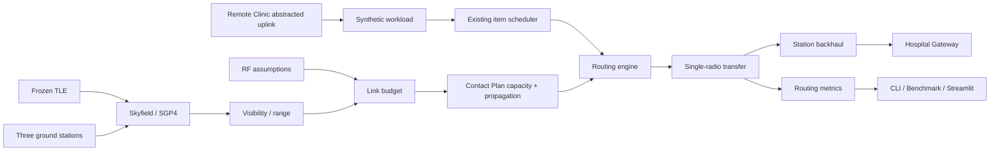

# Architecture

MedLink-LEO keeps orbit and RF physics, item scheduling, route selection, transfer accounting,
experiments, and presentation in separate modules. The CLI, benchmark runner, and Streamlit app
call the same package APIs.

## Module boundaries

| Module | Responsibility |
| --- | --- |
| `models` | Validated synthetic medical items, priorities, and fixed-link configuration |
| `scheduling` | Deterministic FIFO, Priority, and EDF item selection |
| `link` | Static RF equations and a range-independent dynamic-link template |
| `orbit` | Frozen TLE loading, UTC handling, SGP4 propagation, and contact windows |
| `scenarios` | Fixed, intermittent, and routing JSON schemas and validation |
| `simulation.capacity` | Shared midpoint integration from range and RF budget to capacity |
| `simulation` | Fixed-link and pause/resume intermittent-link execution |
| `routing` | Contact-plan construction, route candidates, policies, decisions, and metrics |
| `experiments` | Separate v1.0 scheduler and v1.1 routing benchmark pipelines |
| `cli` | Argument parsing and human/JSON presentation only |
| `app` | Streamlit presentation over tested simulation and routing APIs |

## Routing data flow

1. The routing scenario validates network-node IDs, station coordinates, RF assumptions,
   backhaul delays, UTC times, item data, and a finite horizon.
2. Skyfield propagates the frozen TLE near its epoch. Each station independently produces contact
   windows, range, elevation, and azimuth.
3. `simulation.capacity.build_station_capacity_trace()` samples each interval midpoint and calls
   the existing link-budget implementation. The routing layer does not duplicate FSPL, noise,
   SNR, or capacity equations.
4. The contact-plan builder integrates interval capacity and records a capacity-weighted one-way
   propagation delay for each satellite-to-station opportunity.
5. An existing scheduler selects the next ready medical item. The routing engine then evaluates
   candidate contacts under one routing policy.
6. RF completion advances the single shared satellite-radio clock. Station backhaul contributes
   to hospital arrival but does not block that radio.
7. Route results retain every candidate and a deterministic decision reason for JSON, tests, the
   benchmark, and the Web Demo.

## Routing and scheduling boundary

Scheduling answers **which item is considered next**. Routing answers **which ground station and
contact that item should use**. The v1.1 example fixes scheduling to EDF while comparing three
routing policies. Schedulers remain reusable and are not embedded in the routing implementation.

## Extension points

- `RoutingStrategy` and the rank functions define deterministic routing-policy behavior.
- `ContactPlan` is a stable boundary between orbit/RF modeling and routing decisions.
- `CapacityInterval` is shared by intermittent simulation and routing, allowing future validated
  channel models without rewriting queue logic.
- Route candidates expose capacity, timing, and feasibility rather than hiding decisions inside a
  monolithic optimizer.

## Why the UI is separate

`app/streamlit_app.py` contains no orbital, RF, scheduling, or routing equations. It formats
`RoutingComparisonReport` and existing simulation reports, so the Web path cannot silently become
a second implementation.
